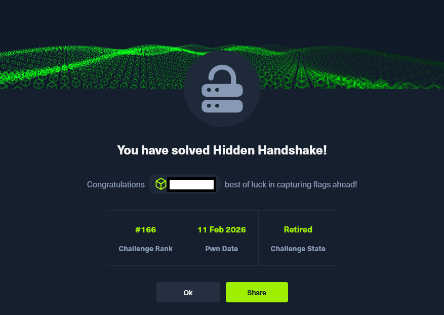

# HTB Challenge - Hidden Handshake

El desafío Hidden Handshake, perteneciente a la categoría de criptografía en HackTheBox, plantea el análisis y explotación de un servicio remoto que implementa un mecanismo de cifrado aparentemente robusto basado en AES en modo CTR. A primera vista, el servicio parece adherirse a prácticas criptográficas estándar: deriva claves mediante SHA 256, utiliza un nonce explícito y encapsula la flag dentro de un mensaje cifrado. Sin embargo, un examen minucioso del código revela una concatenación de decisiones de diseño que, en conjunto, erosionan por completo las garantías de seguridad del esquema.

El objetivo de este write up es exponer, con rigor técnico y claridad conceptual, el proceso de identificación de la vulnerabilidad, su fundamentación criptográfica y la construcción de un exploit funcional que permite recuperar la flag sin necesidad de conocer la clave secreta del servidor ni realizar ataques de fuerza bruta. Para ello, se analiza en profundidad el comportamiento del modo CTR, se formaliza matemáticamente el impacto de la reutilización del keystream y se demuestra cómo un atacante puede manipular el espacio de entrada controlado para reconstruir el texto en claro íntegro mediante operaciones XOR.

El resultado es una explotación elegante y determinista que ilustra cómo incluso implementaciones basadas en primitivas criptográficas sólidas pueden volverse completamente inseguras cuando se violan sus invariantes fundamentales. Este análisis no solo resuelve el reto, sino que también pone de manifiesto la importancia de comprender los modos de operación y sus propiedades algebraicas para evaluar la seguridad real de un sistema.

