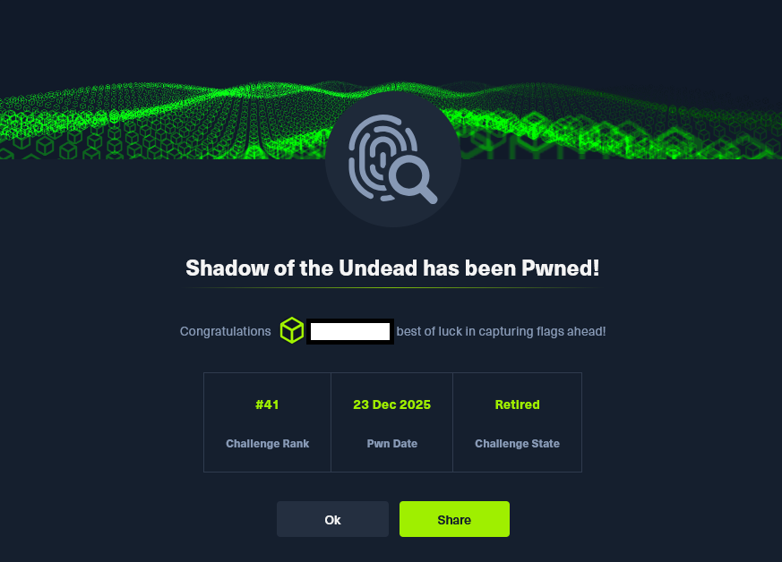

# HTB Challenge - Shadow of the Undead

El análisis comenzó con la observación de una serie de TLVs que evidenciaban la inyección de un payload en memoria y la creación de un hilo remoto, un patrón característico de los stagers utilizados por Metasploit. 
A partir de estos indicadores iniciales, se procedió a extraer el shellcode y a estudiar su estructura interna, identificando rápidamente la presencia de un resolvedor dinámico de APIs y de rutinas propias de un 
cargador reflectivo. Este comportamiento, junto con la secuencia de funciones resueltas, permitió atribuir con alta confianza el payload a un stager reflectivo diseñado para cargar un componente secundario 
directamente en memoria.

Para comprender con precisión el flujo de ejecución del shellcode, se empleó Speakeasy, un emulador basado en Unicorn que permite simular llamadas a la API de Windows mediante un sistema de hooks. 
Aunque la emulación inicial se detuvo debido a funciones no soportadas, la flexibilidad de Speakeasy permitió extender su funcionalidad añadiendo handlers personalizados para RegSetKeyValueA y NetUserSetInfo(), 
lo que posibilitó continuar la ejecución sin necesidad de implementar operaciones reales sobre el Registro o el subsistema de cuentas.

El análisis del comportamiento emulado reveló que el shellcode realizaba una comprobación de entorno consultando claves asociadas a hipervisores, una técnica habitual de anti análisis. 
A continuación, accedía al SAM para obtener el RID de la cuenta biohazard_mgmt_guest, construía dinámicamente la ruta hacia la clave correspondiente y leía el contenido de la subclave F, 
un paso típico en ataques de manipulación de identidad como el RID Hijacking.

La fase final del payload se centraba en la llamada a NetUserSetInfo() con un nivel de 1003, lo que indicaba que el buffer apuntaba a una estructura USER_INFO_1003. 
Esta estructura contiene un único campo: un puntero a una cadena Unicode que representa la nueva contraseña que se desea asignar al usuario. 
Mediante la ampliación del hook y la lectura directa del espacio de memoria emulado, fue posible extraer la contraseña que el shellcode pretendía establecer, completando así la reconstrucción del ataque.

