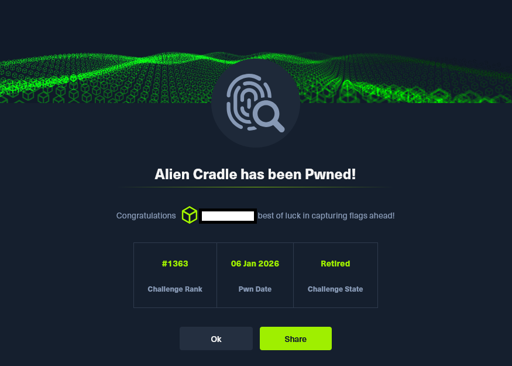

# HTB Challenge - Alien Cradle

En el presente análisis técnico abordo la resolución del reto Alien Cradle de Hack The Box, un ejercicio orientado a evaluar la capacidad del analista para identificar, desofuscar y comprender artefactos ejecutables en entornos Windows. El desafío se articula en torno a un script de PowerShell deliberadamente manipulado para ocultar su lógica interna y dificultar la trazabilidad de su flujo de ejecución, reproduciendo con notable fidelidad las técnicas de evasión y persistencia empleadas en escenarios reales de intrusión. A lo largo del write up desarrollo un proceso metodológico de inspección, desofuscación y reconstrucción del comportamiento del script, poniendo de relieve tanto la infraestructura remota empleada por el atacante como los mecanismos de validación, carga en memoria y ejecución encubierta del payload. El objetivo es evidenciar un enfoque analítico riguroso, fundamentado en buenas prácticas de laboratorio seguro y en una comprensión profunda de los vectores de abuso más frecuentes en entornos corporativos.

