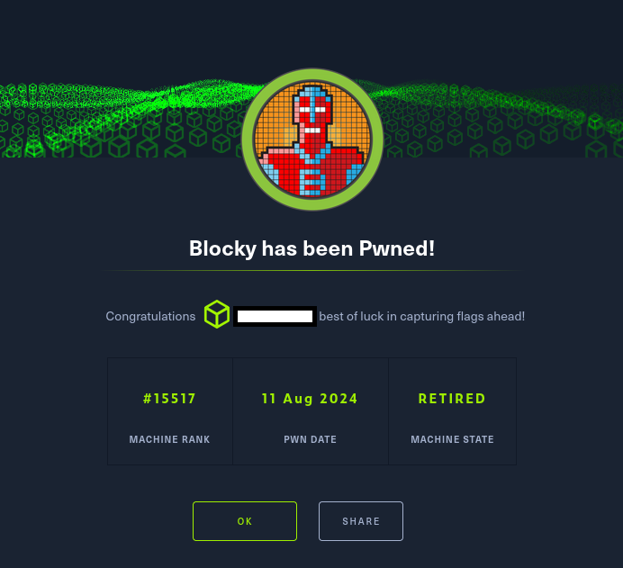

# Hack The Box - Blocky

A través de técnicas de reconocimiento activo y pasivo, se identificó la presencia de virtual hosting, lo que requirió la modificación del archivo /etc/hosts para un correcto direccionamiento. Posteriormente, se llevó a cabo un escaneo de directorios mediante Gobuster, revelando recursos ocultos dentro del servidor, incluido el directorio plugins, en el cual se localizaron aplicaciones desarrolladas en Java. La decompilación de una de dichas aplicaciones permitió la obtención de credenciales asociadas al usuario root, las cuales eran válidas para la autenticación en phpMyAdmin. Si bien no fue posible descifrar la clave almacenada, se generó una nueva utilizando la función password_hash() de PHP, aprovechando su capacidad para realizar hashing seguro de contraseñas.

El acceso al sistema también se fortaleció mediante el uso de WPScan, permitiendo la enumeración de usuarios y plugins activos del CMS WordPress alojado en el servidor. Además, se descubrió que las credenciales obtenidas previamente podían ser utilizadas para conectarse vía SSH como el usuario notch, lo que facilitó el acceso al sistema y la posterior verificación de permisos elevados con el comando sudo -l. La configuración encontrada evidenció la capacidad de ejecutar comandos con privilegios de administrador, lo que simplificó la escalada de privilegios hasta obtener el control total de la máquina. Asimismo, se identificó que la máquina era vulnerable a la explotación de la DCCP Double-Free technique (CVE-2017-6074), un fallo crítico en el kernel de Linux que permite la ejecución de código arbitrario con privilegios elevados. Este write-up, por tanto, no solo documenta la explotación de la máquina, sino que también refleja el enfoque metodológico aplicado en cada etapa, demostrando habilidades clave en pentesting ofensivo.

