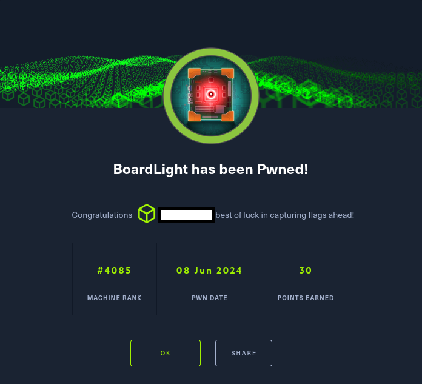

# Hack The Box - BoardLight

La resolución de la máquina Boardlight de HackTheBox se articuló como un ejercicio integral de auditoría ofensiva, en el que se aplicaron metodologías de reconocimiento, enumeración y explotación orientadas a la obtención de acceso privilegiado en un entorno corporativo simulado. El proceso se inició con la identificación de un dominio asociado y la configuración de resolución mediante virtual hosting, lo que permitió descubrir servicios expuestos y aplicaciones críticas como Dolibarr ERP/CRM. La explotación de credenciales por defecto y la investigación de vulnerabilidades específicas —entre ellas la CVE 2023 30253, que habilita ejecución remota de código en versiones anteriores a la 17.0.1— posibilitaron la consolidación de una reverse shell y el acceso interactivo al sistema.

Posteriormente, la enumeración de usuarios y archivos de configuración reveló credenciales reutilizadas y la presencia de binarios con privilegios especiales, destacando Enlightenment, marcado con el bit SUID. La verificación de su versión (0.23.1) permitió identificar la vulnerabilidad CVE 2022 37706, cuya explotación derivó en una escalada de privilegios hasta el superusuario (root).

