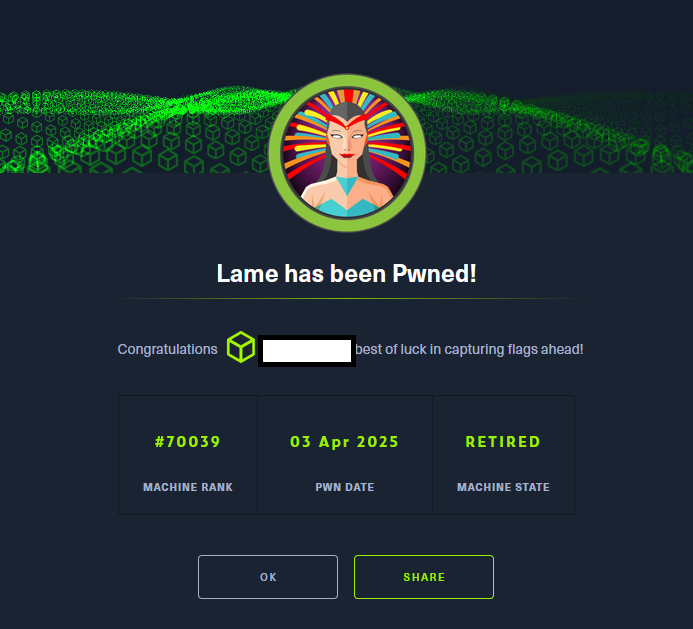

# Hack The Box - Lame

En este reto planteado por la plataforma Hack The Box, se realizó una exploración exhaustiva de un servicio
Samba expuesto, utilizando herramientas como smbclient para navegar los recursos compartidos. Aunque
inicialmente no se identificó información de alto valor en los directorios remotos, se detectó una instalación
vulnerable de Samba en su versión 3.0.2. Esta versión presenta la debilidad crítica CVE-2007-2447, la cual
permite la ejecución remota de comandos a través de la mala sanitización de entradas en funciones MSRPC,
abriendo la puerta a una escalada de privilegios.

Este proceso demuestra habilidades de reconocimiento de servicios, explotación de vulnerabilidades
conocidas, escalado de privilegios y post-explotación orientada a recolección de credenciales.

