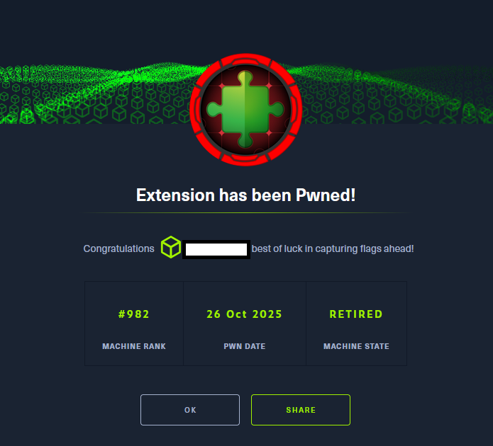

# Hack The Box - Extension

El presente documento expone, de manera estructurada y exhaustiva, el proceso de compromiso integral de la infraestructura asociada a snippet.htb. 
La investigación pone de manifiesto cómo una cadena de vulnerabilidades —aparentemente aisladas y de distinta naturaleza— puede converger en un escenario de riesgo crítico para la organización. 
A través de un análisis metódico, se evidencia cómo fallos de validación, configuraciones deficientes, prácticas criptográficas inapropiadas y una gestión laxa de contenedores derivan en una pérdida 
completa de confidencialidad, integridad y disponibilidad del sistema.

El ejercicio comienza con una fase de enumeración que revela puntos de exposición inadvertidos y filtraciones de información sensible.
A partir de ahí, se identifican debilidades en los mecanismos de autenticación y control de acceso, así como una reutilización de credenciales que facilita 
el movimiento lateral entre distintos entornos. Posteriormente, la explotación de una vulnerabilidad de Cross Site Scripting persistente permite interactuar con una API interna protegida, 
habilitando la extracción de datos y la manipulación de recursos internos mediante peticiones autenticadas.

El análisis adquiere una dimensión más profunda al descubrir un mecanismo de validación basado en SHA 256 vulnerable a un ataque de extensión de longitud, lo que posibilita la manipulación de 
parámetros críticos sin conocimiento del secreto subyacente. Esta debilidad, combinada con la presencia de funciones de ejecución de comandos en el backend, habilita la obtención de ejecución remota de 
código en el servidor.

Finalmente, la exposición del socket de Docker y la ausencia de controles de aislamiento adecuados permiten escalar privilegios hasta alcanzar el control total del host, 
culminando en el acceso directo como usuario root. Este escenario ilustra de forma contundente cómo la acumulación de vulnerabilidades de distinta índole puede 
comprometer por completo la seguridad de un entorno corporativo.

