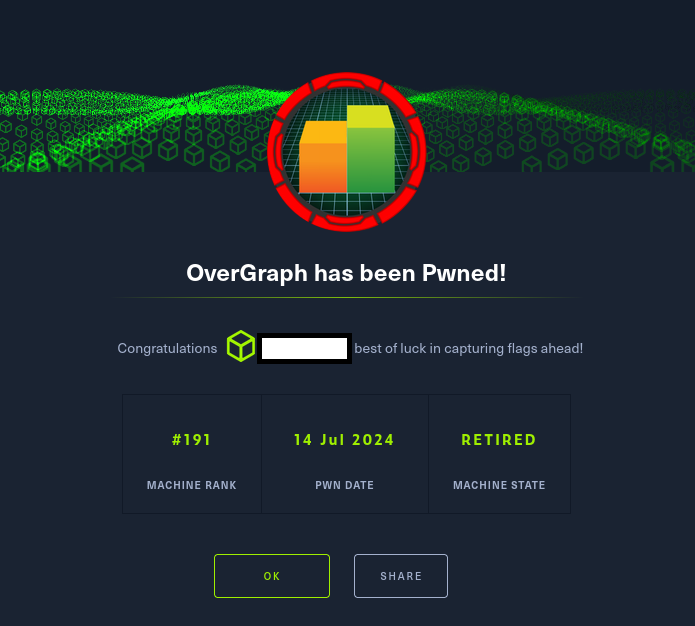

# Hack The Box - Overgraph

La explotación de la máquina se desarrolla a través de una cadena de vulnerabilidades que abarca desde fallos de validación en la interfaz web hasta debilidades críticas en la gestión de memoria de un binario con privilegios elevados. El punto de partida es una aplicación web que almacena información sensible en cookies manipulables desde el navegador. Tras modificar el valor del parámetro admin, se habilita la funcionalidad de subida de archivos, aunque aún inaccesible por la ausencia de un adminToken válido.
La investigación continúa con el descubrimiento de una vulnerabilidad de Server Side Template Injection (SSTI) en los campos del perfil de usuario, que permite escalar a un XSS persistente. Mediante técnicas de enumeración de GraphQL y explotación de la falta de protección CSRF, se identifica al usuario privilegiado Larry y se construye un ataque encadenado que combina XSS + CSRF + SameSite bypass, logrando finalmente la exfiltración de su adminToken.

Con privilegios administrativos en la aplicación, se accede a la funcionalidad de subida de vídeos, cuyo procesamiento interno revela el uso de FFmpeg. Aprovechando una vulnerabilidad conocida que permite SSRF y lectura arbitraria de archivos, se extrae progresivamente la clave SSH del usuario user, lo que posibilita el acceso al sistema.

Una vez dentro, la enumeración local revela un servicio interno en el puerto 9851, gestionado por un binario llamado Nreport ejecutado como root. Tras transferir el binario y sus dependencias al entorno local, se identifica un mecanismo de autenticación débil y una vulnerabilidad crítica de Use After Free (UAF) en la gestión del heap. Mediante ingeniería inversa y manipulación de los punteros internos forward y backward, se construye un fake chunk que permite redirigir las operaciones del asignador hacia la estructura userinfo1, sobrescribiendo la cadena de comandos ejecutada al salir de la aplicación. Esta técnica proporciona una primitiva de ejecución arbitraria como root.

Finalmente, se modifica el binario /bin/bash para establecer el bit SUID, obteniendo así control total sobre el sistema y completando la explotación de la máquina.

