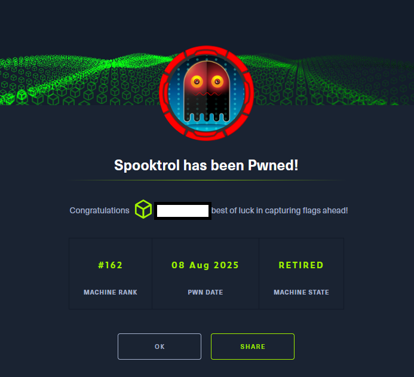

# Hack The Box - Spooktrol

La resolución de la máquina Spooktrol de Hack The Box constituyó un ejercicio integral de análisis ofensivo que combinó técnicas avanzadas de enumeración, ingeniería inversa, análisis estático y dinámico de binarios, así como la explotación de debilidades en la infraestructura de mando y control. El proceso permitió desentrañar el funcionamiento interno de un implante escrito en C++, identificar sus capacidades de ejecución remota, exfiltración y transferencia de archivos, y reconstruir su protocolo de comunicación basado en JSON sobre HTTP. 

A través de un estudio minucioso del flujo de ejecución, incluyendo la desofuscación de cadenas mediante XOR, la instrumentación del tráfico mediante BurpSuite y la emulación controlada del entorno mediante Docker, fue posible no solo comprender la lógica operativa del malware, sino también subvertirla para obtener acceso persistente al contenedor comprometido y, posteriormente, al propio host. La explotación final, basada en la manipulación directa de la base de datos del C2 y la inyección de tareas maliciosas, culminó en la obtención de una reverse shell con privilegios elevados, demostrando la criticidad de las vulnerabilidades presentes y la importancia de un enfoque metodológico exhaustivo en entornos de análisis de amenazas.

