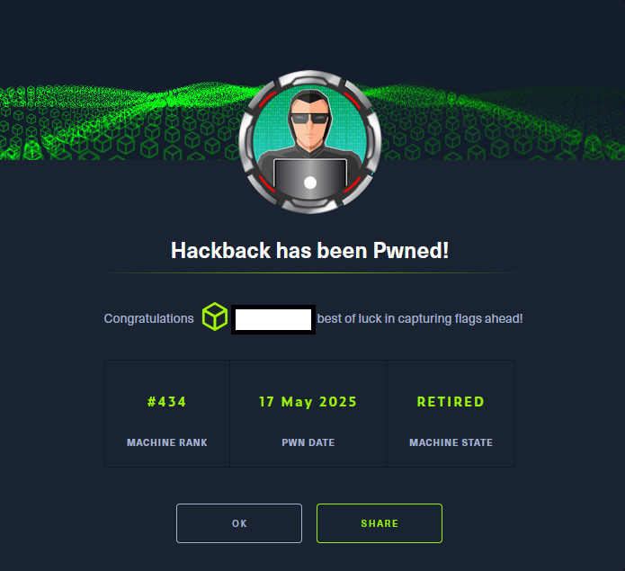

# Hack The Box - Hackback

La resolución de la máquina HacktBack de Hack The Box constituyó un ejercicio integral de pentesting en entornos Windows, en el que se combinaron técnicas de enumeración avanzada, 
explotación de servicios expuestos, pivoting mediante túneles encubiertos y escalada de privilegios a través de mecanismos propios del sistema operativo.

El proceso se inició con un reconocimiento exhaustivo mediante Nmap, que reveló la presencia de servicios heterogéneos, entre ellos un endpoint HTTP/2 en un puerto no estándar y un servidor IIS. 
La interacción con dichos servicios permitió descubrir un panel de GoPhish en una versión antigua con credenciales por defecto, lo que abrió la puerta a la exploración de plantillas de phishing y a 
la identificación de subdominios adicionales.

La fase de enumeración web se enriqueció con el uso de Gobuster y el análisis de código fuente, que condujo al hallazgo de scripts ofuscados en ROT13 y a la localización de rutas ocultas con parámetros sensibles. 
El tráfico fue posteriormente interceptado y manipulado con Burp Suite, lo que permitió correlacionar credenciales y acceder a recursos internos.

Una vez validada la ejecución remota de código mediante la inyección de PHP, se emplearon funciones nativas del lenguaje (scandir, file_get_contents, file_put_contents) para enumerar directorios y extraer 
archivos de configuración históricos, como web.config.old, que contenían credenciales reutilizables. La explotación se amplió con la carga de un webshell ASPX y la utilización de reGeorg para establecer un túnel SOCKS5, 
posibilitando el pivoting y el acceso a servicios internos como WinRM.

En la fase de post-explotación, la enumeración de privilegios reveló que el usuario comprometido disponía del derecho SeImpersonatePrivilege, lo que habilitó la explotación de named pipes para suplantar tokens de seguridad. 
Paralelamente, se identificaron archivos de configuración manipulables (clean.ini) asociados a tareas programadas, que permitieron inyectar comandos y redirigir la ejecución hacia recursos controlados por el atacante, 
incluso bajo las restricciones impuestas por AppLocker.

Finalmente, el análisis de servicios mostró que UserLogger, ejecutado como SYSTEM, podía ser manipulado gracias a permisos explícitos en su descriptor de seguridad (SDDL). Mediante la combinación de estos vectores, 
se logró escalar privilegios hasta NT AUTHORITY\SYSTEM. El desenlace se materializó en la lectura de la flag de root, aprovechando las particularidades de NTFS Alternate Data Streams (ADS) 
y el uso del carácter “:” para redirigir la escritura hacia flujos alternativos de datos.

