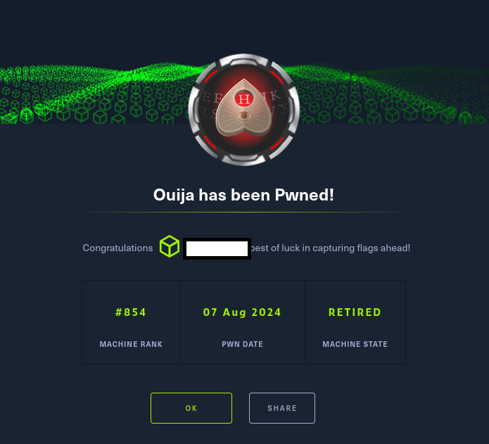

# Hack The Box - Ouija

Ouija es una máquina Linux de dificultad Insane que presenta un conjunto de vulnerabilidades que requieren largos y complicados pasos para ser explotadas. Inicialmente, se encuentra una aplicación web protegida detrás de HAProxy. Al explotar la vulnerabilidad CVE-2021-40346, se obtiene acceso a un subdominio protegido. A través de este subdominio, se descubre el código fuente de la API alojada en el puerto 3000 y su script de inicialización, lo que lleva al descubrimiento de un ataque de extensión de longitud de hash. Al explotar esta vulnerabilidad, se obtiene acceso a un endpoint de lectura de archivos de la API, permitiendo la recuperación de claves privadas SSH.

Una vez obtenido el acceso al sistema local, se descubre una aplicación web interna escrita en PHP, que utiliza una función perteneciente a una librería personalizada escrita en C vulnerable a un desbordamiento de enteros. Explotando esta vulnerabilidad, se consigue acceso root al sistema.

