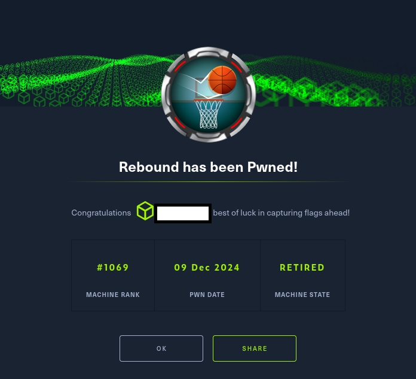

# Hack The Box - Rebound

La máquina Rebound, catalogada con nivel Insane en Hack The Box, constituye un desafío avanzado en
entornos Windows y Active Directory, diseñado para poner a prueba la capacidad de análisis y explotación
en escenarios complejos de seguridad corporativa. El recorrido de intrusión se articula en múltiples fases
encadenadas que ilustran con claridad la interacción entre técnicas clásicas y vectores modernos de ataque.

El proceso inicial parte de la enumeración de usuarios mediante RID cycling, que permite identificar
una cuenta vulnerable a AS-REP Roasting. A partir de su TGT, se desencadena un ataque de
Kerberoasting sobre otra cuenta con contraseña débil, abriendo la puerta a la explotación de ACLs mal
configuradas. Estas debilidades facultan el acceso a un grupo con privilegios de FullControl sobre una
unidad organizativa, habilitando un Descendant Object Takeover (DOT) y, posteriormente, un ataque de
ShadowCredentials sobre un usuario con acceso remoto vía WinRM.

La cadena de explotación se intensifica con la aplicación de un cross-session relay, técnica que permite
capturar el hash NetNTLMv2 de un usuario conectado. Una vez descifrado, este conduce a la lectura de la
contraseña de una Group Managed Service Account (gMSA), cuya capacidad de delegación, aunque
limitada por la ausencia de transición de protocolo, se convierte en el punto de partida para un ataque de
Resource-Based Constrained Delegation (RBCD). Mediante esta técnica, se logra la suplantación del
Domain Controller y la ejecución de un DCSync attack, consolidando finalmente privilegios de
administrador de dominio y completando el compromiso total de la infraestructura.

