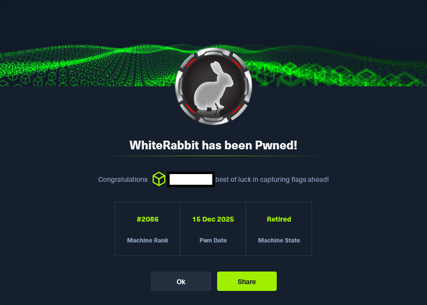

# Hack The Box - Whiterabbit

La resolución de Whiterabbit se articuló como un ejercicio integral de reconocimiento, análisis y explotación encadenada que permitió comprometer progresivamente cada uno de los componentes de la infraestructura objetivo. 
El proceso se inició con una fase de enumeración exhaustiva en la que, ante la ausencia de vectores evidentes en la interfaz web principal, se procedió a identificar subdominios adicionales y servicios auxiliares. 
Este esfuerzo reveló la presencia de un panel de Uptime Kuma, una instancia de Wiki.js y un flujo de automatización en n8n vinculado a webhooks de GoPhish, cuya documentación interna filtraba información crítica, 
incluido el secreto HMAC utilizado para firmar las peticiones entrantes.

El análisis del flujo permitió detectar una vulnerabilidad de inyección SQL basada en errores en el procesamiento de los datos de phishing, inicialmente protegida por la verificación criptográfica del webhook. 
La obtención del secreto HMAC posibilitó reproducir firmas válidas y, mediante un script en Python, automatizar la explotación y exfiltrar información sensible, entre la que destacaba el registro de comandos 
administrativos recientes. Este hallazgo condujo al descubrimiento de un servidor restic configurado de forma insegura, cuyo repositorio contenía copias de seguridad cifradas con claves recuperables. 
Tras descifrar el archivo comprimido, se obtuvo la clave SSH del usuario bob, lo que permitió acceder a un contenedor Docker y, desde allí, abusar de permisos excesivos en la ejecución de restic para escalar 
a root dentro del contenedor.

La cadena de explotación continuó con la obtención de la clave SSH del usuario morpheus y el análisis del binario neo-password-generator, responsable de regenerar la contraseña del usuario neo. 
La ingeniería inversa del ejecutable reveló un generador determinista basado en la hora de ejecución, lo que permitió reconstruir la contraseña exacta mediante un ataque de fuerza bruta acotado temporalmente. 
Con acceso a la cuenta de neo —miembro del grupo sudo— la escalada final a root en el sistema anfitrión resultó inmediata, completando así el compromiso total de la máquina.

