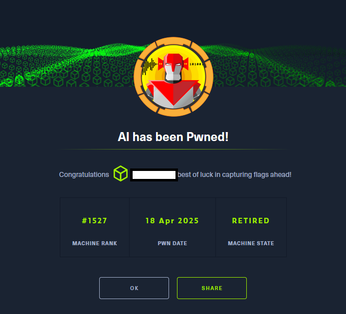

# Hack The Box - AI

La resolución de la máquina AI de Hack The Box constituyó un ejercicio práctico de análisis ofensivo en el que apliqué una metodología estructurada para identificar, 
explotar y encadenar vulnerabilidades presentes en un entorno web orientado al procesamiento de audio mediante técnicas de reconocimiento de voz. 
El objetivo principal fue evaluar la resiliencia de la plataforma frente a vectores de ataque no convencionales y demostrar la capacidad de comprometer un sistema a través de una cadena de explotación completa.

El análisis permitió detectar una debilidad crítica en el flujo de interpretación de entradas fonéticas, que derivaba en la ejecución de consultas SQL manipulables. 
A partir de esta superficie de ataque, desarrollé un proceso automatizado que integraba síntesis de audio, análisis de respuestas y construcción dinámica de cargas maliciosas, 
lo que facilitó la extracción de credenciales válidas y el acceso inicial al sistema.

En la fase de post explotación, la identificación de un servicio Tomcat configurado con un punto de depuración JDWP expuesto posibilitó la ejecución arbitraria de código a nivel de máquina virtual Java. 
Mediante técnicas de inyección de bytecode, fue posible escalar privilegios hasta obtener control total del sistema con permisos de root.

