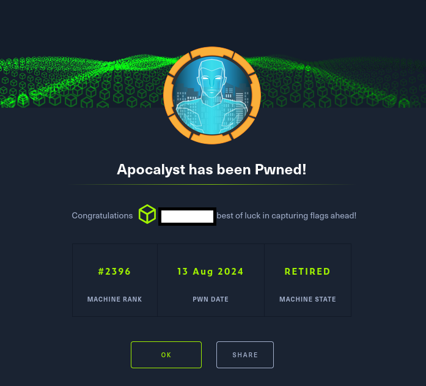

# Hack The Box - Apocalyst

Inicialmente, se realizó un reconocimiento de la infraestructura mediante cURL, identificando un dominio que posteriormente fue incorporado en el archivo /etc/hosts para facilitar su resolución. A partir de este punto, se desplegó un análisis mediante WPScan, con el objetivo de enumerar usuarios y detectar posibles vulnerabilidades en plugins de WordPress, aunque los resultados obtenidos fueron limitados.

Ante la falta de vectores de ataque inmediatos, se optó por un enfoque de fuzzing con WFuzz, lo que permitió expandir el alcance de la auditoría. Posteriormente, se generó un diccionario personalizado con CeWL, empleándolo en un nuevo proceso de fuzzing que proporcionó resultados más prometedores. Dentro del proceso de exploración, se identificó una imagen en la página web, sugiriendo la posibilidad de esteganografía. Para verificar esta hipótesis, se utilizó Stegseek, logrando extraer una lista de palabras que posteriormente facilitaría un ataque de fuerza bruta contra WordPress. Con esta lista, se empleó WPScan para obtener las credenciales del usuario falaraki, permitiendo el acceso al dashboard de WordPress. Una vez dentro, se aprovechó una vulnerabilidad que permitía modificar el archivo 404.php, insertando un script en PHP para la ejecución remota de comandos. Esto proporcionó acceso inicial al sistema con privilegios de www-data, permitiendo una nueva fase de explotación.

La escalada de privilegios se realizó mediante la identificación de un archivo .secret en la carpeta de falaraki, codificado en Base64, aunque su contenido no resultó útil en primera instancia. Sin embargo, el hallazgo crítico surgió al detectar permisos de escritura universales en /etc/passwd, lo que abrió la posibilidad de modificar las credenciales del usuario root. A través del comando OpenSSL, se generó un nuevo hash de contraseña que fue insertado en el archivo, permitiendo finalmente acceder como root y completar el reto.

