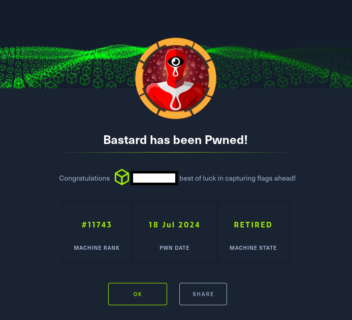

# Hack The Box - Bastard

La resolución de la máquina Bastard de HackTheBox se articuló en torno a una metodología ofensiva rigurosa, iniciada con la identificación de un servicio web basado en Drupal. La enumeración inicial permitió detectar la versión exacta del CMS a través del archivo CHANGELOG.txt, lo que posibilitó correlacionar el entorno con una vulnerabilidad documentada en Exploit-DB. Tras la adaptación del exploit público, se obtuvieron credenciales de sesión administrativas y se desplegó un webshell en PHP, habilitando la ejecución remota de comandos.

A partir de este punto, el análisis del sistema reveló que se trataba de un Windows Server 2008 R2 Datacenter, cuya obsolescencia lo hacía susceptible a múltiples vectores de escalada. La ejecución del script Sherlock permitió identificar la vulnerabilidad CVE-2015-1701 en el controlador Win32k.sys, cuya explotación facilitó la elevación de privilegios hasta el contexto NT AUTHORITY\SYSTEM.

Este recorrido, desde la explotación inicial de la aplicación web hasta la consolidación del control total del sistema, evidencia la importancia de una aproximación metódica que combine enumeración exhaustiva, correlación de vulnerabilidades y adaptación de exploits. La práctica no solo refuerza competencias técnicas en intrusión controlada, sino que también pone de relieve la necesidad de mantener actualizados los sistemas en entornos corporativos para mitigar riesgos de seguridad críticos.

