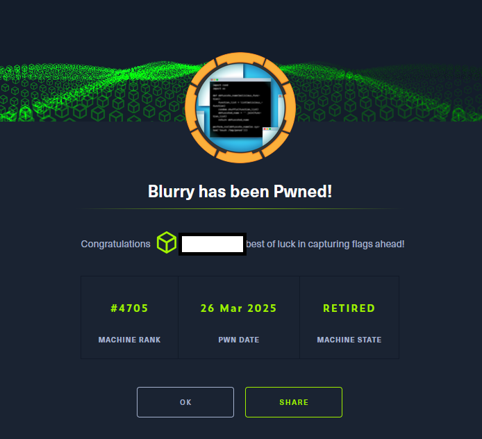

# Hack The Box - Blurry

La resolución de la máquina Blurry supuso la aplicación de un enfoque metodológico integral de penetration testing, abarcando desde la enumeración inicial de superficies expuestas hasta la explotación 
encadenada de vulnerabilidades críticas en entornos de colaboración y machine learning. El proceso se inició con un reconocimiento exhaustivo de dominios y subdominios mediante técnicas de fuzzing y fuerza bruta, 
lo que permitió identificar servicios clave como Rocket.Chat y ClearML.

El análisis de la instancia de Rocket.Chat reveló información contextual relevante, incluyendo referencias a flujos automatizados en el proyecto Black Swan de ClearML. 
La inspección de esta plataforma, desplegada en una versión obsoleta (1.13.1), permitió correlacionar su arquitectura con vulnerabilidades documentadas —CVE 2024 24590 y CVE 2024 24592— 
cuya explotación combinada posibilitó la inyección y ejecución de artefactos maliciosos.

La intrusión inicial se consolidó mediante el acceso a credenciales y la explotación de debilidades en la carga de modelos de PyTorch (.pth), aprovechando la inseguridad inherente del módulo 
pickle de Python. El análisis con Fickling evidenció deficiencias en la integración de controles defensivos, lo que permitió eludir validaciones y escalar privilegios hasta obtener acceso como usuario root.

Este ejercicio no solo demostró la viabilidad de ataques de attack chaining en entornos MLOps, sino que también puso de relieve la importancia de la gestión de versiones, 
la validación estricta de artefactos y la integración efectiva de herramientas de análisis en pipelines de producción. La resolución se desarrolló íntegramente en un entorno controlado de laboratorio, 
siguiendo principios de ética profesional y divulgación responsable.

