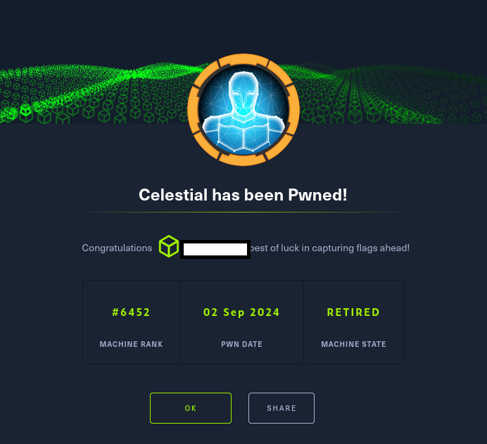

# Hack The Box - Celestial

La resolución de la máquina Celestial de Hack The Box constituyó un ejercicio integral de análisis ofensivo en el que se abordaron de manera progresiva distintas fases de intrusión y escalada de privilegios. 
El punto de partida fue el examen de la aplicación web expuesta, cuya superficie de ataque inicial parecía carente de vectores evidentes. No obstante, la inspección de los artefactos de sesión reveló una cookie 
codificada en Base64 que, tras su decodificación, resultó ser un objeto en formato JSON. Este hallazgo condujo a la hipótesis de una posible deserialización insegura en un entorno Node.js, hipótesis que se confirmó 
al explotar la vulnerabilidad CVE-2017-5941 en la librería node-serialize.

La explotación se sustentó en la inyección de un objeto malicioso que contenía una Immediately Invoked Function Expression (IIFE), lo que permitió transformar el proceso de deserialización en un mecanismo de ejecución 
remota de comandos (RCE) sobre la máquina objetivo. Una vez consolidado el acceso inicial, la fase de post-explotación se orientó hacia la monitorización de procesos mediante la herramienta pspy, que reveló la ejecución 
periódica de un script en Python con permisos de escritura. La manipulación de dicho script posibilitó la inyección de código arbitrario, cuya ejecución automática derivó en la obtención de privilegios de superusuario (root).

