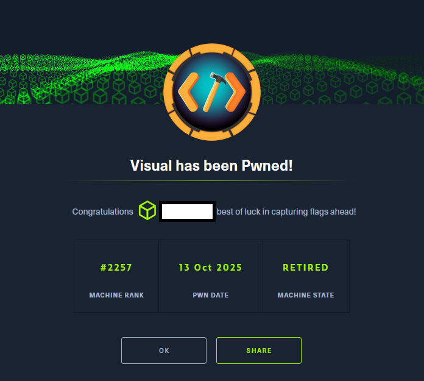

# Hack The Box - Visual

El análisis comenzó con la identificación de servicios expuestos, destacando un servidor web en el puerto
80 que ofrecía la compilación remota de proyectos en .NET 6.0. A partir de este hallazgo, diseñé un
repositorio Git manipulado, estructurado mediante la utilidad de línea de comandos dotnet, en el que
modifiqué el archivo .csproj para introducir comportamientos controlados durante la compilación.
Posteriormente, inicialicé y configuré el repositorio con Git, asegurando su correcta exposición mediante
git --bare update-server-info, lo que permitió que la máquina objetivo descargara íntegramente el proyecto
malicioso.
Este vector facilitó la obtención de una primera reverse shell, desde la cual confirmé que la aplicación web
se ejecutaba bajo la cuenta NT AUTHORITY\LOCAL SERVICE. Tras insertar una webshell en el
directorio raíz, realicé una enumeración exhaustiva del entorno, constatando que dicha cuenta carecía de
varios privilegios que normalmente le corresponden por defecto. Para solventar esta limitación, recurrí al
binario FullPowers, con el que restauré los privilegios originales de la cuenta, habilitando entre ellos el
crítico SeImpersonatePrivilege.
La explotación de este privilegio se materializó mediante la herramienta GodPotato, que permitió abusar
de la suplantación de tokens de seguridad y ejecutar código arbitrario bajo el contexto de NT
AUTHORITY\SYSTEM. De este modo, culminé con éxito la escalada de privilegios y obtuve control
total sobre la máquina, completando así el reto propuesto.

