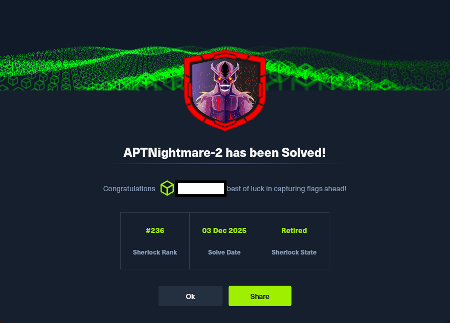

# HTB Sherlock - APTNightmare-2

La presente resolución documenta de manera sistemática el análisis forense realizado sobre un entorno
Linux comprometido, con el objetivo de identificar y caracterizar un módulo de kernel malicioso. A lo largo
de las distintas fases se emplearon plugins especializados de Volatility y herramientas de desensamblado
como Ghidra, nm y readelf, lo que permitió reconstruir la cronología del ataque, detectar técnicas de
ocultación y establecer la correlación con tácticas recogidas en la matriz MITRE ATT&CK.

El trabajo se estructura en once preguntas clave que guían el proceso de investigación: desde la
identificación de la conexión de reverse shell y su proceso asociado, hasta la detección del módulo oculto,
el cálculo de su hash criptográfico y el contraste con el archivo legítimo. Cada hallazgo se contextualiza
dentro de un marco metodológico riguroso, destacando cómo el adversario desplegó tácticas de defense
evasion, masquerading y rootkit para garantizar persistencia y dificultar la atribución.

