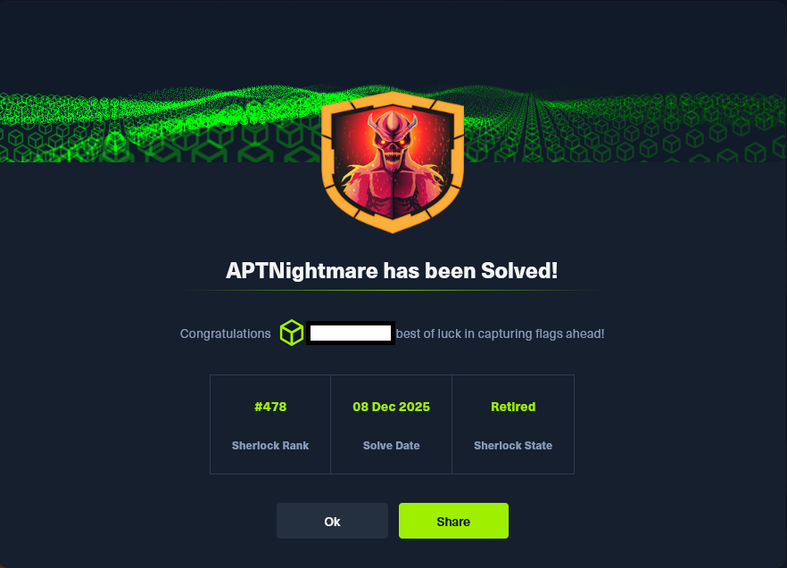

# HTB Sherlock - APTNightmare

El presente documento recoge el análisis forense integral de un incidente de seguridad que afectó a un
entorno corporativo, en el cual se identificaron múltiples vectores de ataque y mecanismos de persistencia
empleados por el adversario. A través de la combinación de herramientas especializadas —como Volatility,
Wireshark, RegRipper, Chainsaw, CyberChef y utilidades específicas de análisis de malware como
1768.py— se logró reconstruir la cadena completa de intrusión, desde el acceso inicial hasta la ejecución
de cargas maliciosas y la consolidación de la persistencia en los sistemas comprometidos.

El estudio se apoya en la correlación de evidencias extraídas de memoria RAM, imágenes de disco y
capturas de tráfico de red, lo que permitió identificar procesos sospechosos, correos electrónicos de
phishing, adjuntos maliciosos y configuraciones de beacons de Cobalt Strike. Cada hallazgo se
contextualizó dentro del marco MITRE ATT&CK, vinculando las evidencias con técnicas específicas
como T1037 – Boot or Logon Initialization Scripts, T1566.001 – Phishing: Spearphishing Attachment,
T1059.001 – Command and Scripting Interpreter: PowerShell, T1053 – Scheduled Task/Job, T1071
– Application Layer Protocol y T1105 – Ingress Tool Transfer, entre otras.

Este enfoque metodológico no solo permitió describir con precisión los artefactos y comandos utilizados
por el adversario, sino también ofrecer una visión estructurada del ataque en términos de tácticas, técnicas
y procedimientos (TTPs).

En definitiva, la resolución expone de manera clara y didáctica cómo el adversario logró comprometer el
entorno corporativo, qué mecanismos empleó para mantener su presencia y cómo se pueden correlacionar
estos hallazgos con técnicas documentadas en MITRE ATT&CK, ofreciendo así un informe con rigor
técnico y valor estratégico para la defensa de infraestructuras críticas.

