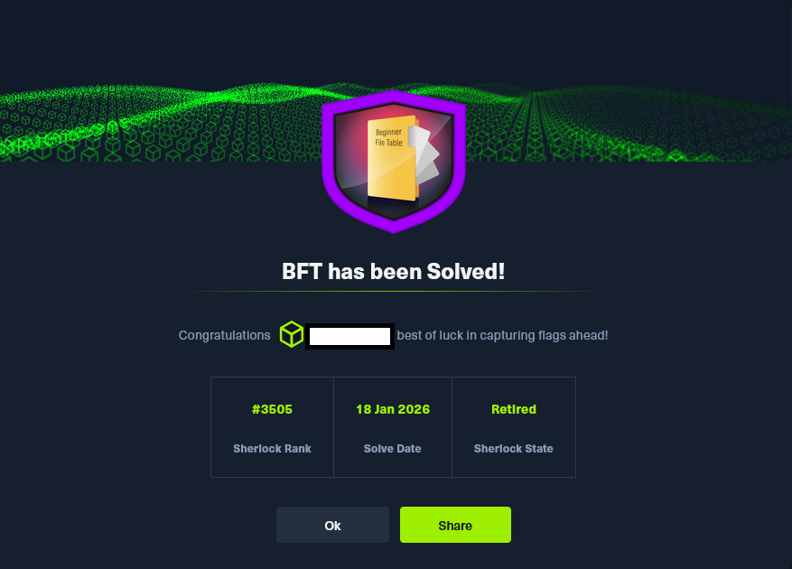

# HTB Sherlock - BFT

El presente análisis forense se centra en la reconstrucción completa de un incidente de seguridad en un sistema Windows, tomando como eje principal la Master File Table (MFT) del sistema de ficheros NTFS. 
La MFT constituye uno de los artefactos más valiosos en cualquier investigación digital, ya que registra de forma exhaustiva la evolución de cada objeto del sistema: creación, modificación, rutas, atributos,
metadatos y, en determinados casos, incluso el contenido íntegro de archivos residentes. Su estudio permite reconstruir con precisión la secuencia de eventos que rodean un compromiso, identificar artefactos 
maliciosos y correlacionar actividades que de otro modo pasarían desapercibidas.

A lo largo de este informe se emplean herramientas especializadas como MFTECmd, Timeline Explorer y editores hexadecimales para extraer, transformar y examinar la información contenida en la MFT. 
Esta aproximación metodológica permite no solo identificar el archivo ZIP que actuó como vector inicial, sino también rastrear la ejecución del stager, localizar su entrada en la MFT, analizar su contenido 
residente y extraer los indicadores de compromiso asociados, incluyendo la dirección IP y el puerto del servidor de mando y control (C2).

El objetivo de este write up es ofrecer una reconstrucción clara, rigurosa y detallada del incidente, mostrando paso a paso cómo la evidencia almacenada en la MFT permite desentrañar la cadena completa de ataque. 
Además, se destacan técnicas y conceptos clave —como los Alternate Data Streams, los atributos internos de NTFS, los resident files o el papel de Attachment Execution Services (AES)— que resultan esenciales para 
cualquier analista que desee abordar investigaciones de este tipo con profundidad y precisión.

