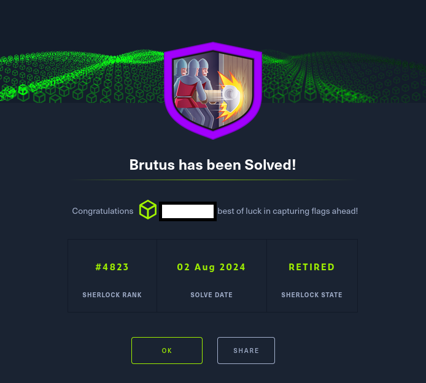

# HTB Sherlock - Brutus

La resolución del reto Brutus de HackTheBox se enmarca en un ejercicio de ciberseguridad defensiva
orientado a la identificación, análisis y neutralización de actividades hostiles en un sistema Linux
comprometido. El desafío consistió en examinar de manera exhaustiva los registros de autenticación
(auth.log) y el historial de sesiones (wtmp), con el propósito de reconstruir la cronología de los eventos,
determinar la naturaleza del ataque y establecer las técnicas empleadas por el adversario.
El análisis permitió detectar un patrón reiterado de intentos fallidos de acceso remoto, característicos de
un ataque de fuerza bruta, culminando en la obtención ilícita de credenciales privilegiadas. A partir de
la correlación entre los ficheros de registro, se identificaron la dirección IP de origen, la cuenta
comprometida, la marca temporal exacta de la intrusión y la duración de la sesión inicial. Asimismo, se
constató la creación de un usuario adicional con privilegios elevados, acción que se corresponde con la
técnica de persistencia T1136.001 – Local Account del marco MITRE ATT&CK, evidenciando la
intención del atacante de mantener acceso prolongado al sistema.

